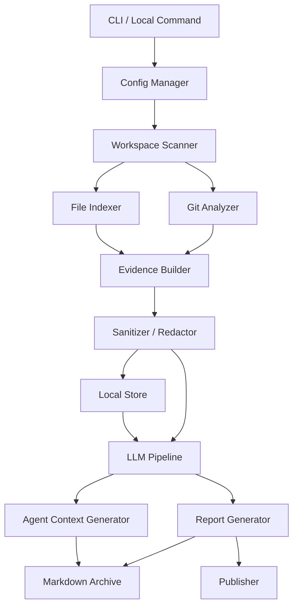
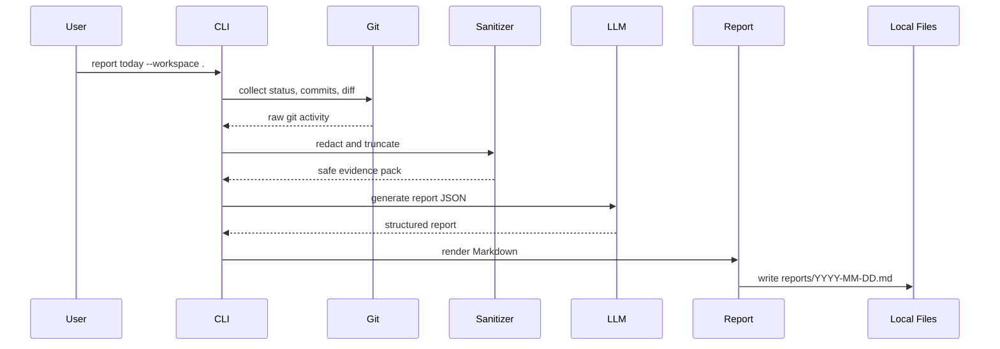
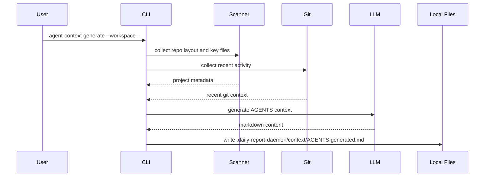

# daily-report-daemon 技术架构拆解

版本：v0.1  
日期：2026-05-29  
关联文档：[PRD-v1.md](./PRD-v1.md)

## 1. 架构目标

daily-report-daemon 的核心技术目标是把本地开发活动转成两类产物：

1. 面向人的产物：日报、周报、项目进展、风险分析、代码变更说明。
2. 面向 agent 的产物：`AGENTS.generated.md`、项目上下文快照、可复用 prompt。

V1 架构必须满足：

- 本地优先：采集、索引、报告归档默认在本机完成。
- 可审计：每条报告结论尽量能追溯到 commit、diff、文件路径或扫描事件。
- 可扩展：模型 provider、上报渠道、报告模板、扫描器都能替换。
- 安全边界清晰：扫描、脱敏、模型调用、上报是独立阶段，方便做策略控制。
- 先验证价值：Phase 0 不做常驻 daemon，先用 CLI 手动验证报告质量。

## 2. 技术栈建议

### 2.1 推荐方案

Phase 0 推荐使用 Go 实现 CLI 原型。

理由：

- 适合做本地常驻进程和跨平台单二进制分发。
- 文件扫描、Git 命令调用、SQLite、HTTP client、配置管理都成熟。
- 后续从手动 CLI 演进到 daemon 的迁移成本低。
- 对团队内部部署友好，不要求用户预装 Node/Python runtime。
- 本期先在 macOS/Linux 上实验，但代码层要避免写死路径分隔符、service 管理方式和凭据存储方式，为 Windows 兼容预留抽象。

建议依赖：

- CLI：`cobra`。
- 配置：`viper` 或轻量 YAML/TOML 解析。
- Git：Phase 0 直接调用本机 `git` CLI，V1 再评估 `go-git`。
- 数据：Phase 0 可用 JSONL + Markdown；V1 升级 SQLite。
- LLM：OpenAI-compatible HTTP API，兼容公网云端模型和内网部署模型，先不绑定单一 SDK。
- 文件忽略：优先复用 `.gitignore` 语义，可引入 ignore parser。

### 2.2 备选方案

TypeScript/Node.js：

- 优点：开发快、LLM SDK 生态好、JSON/Markdown 处理舒服。
- 缺点：常驻 daemon 和单二进制分发体验弱一些。

Python：

- 优点：原型最快、LLM 和文本处理生态强。
- 缺点：分发、后台服务、跨平台安装成本偏高。

Rust：

- 优点：性能与分发好。
- 缺点：原型速度和团队上手成本可能偏高。

结论：如果目标是很快验证报告质量，可以接受 Python/TypeScript；如果目标是从第一天就面向本地 daemon 产品形态，推荐 Go。

## 3. 总体架构



## 4. 模块边界

### 4.1 CLI

职责：

- 提供用户入口。
- 读取配置。
- 执行扫描、报告生成、agent context 生成。
- 输出可读日志和错误信息。

Phase 0 命令建议：

```bash
daily-report-daemon init
daily-report-daemon scan --workspace .
daily-report-daemon report today --workspace .
daily-report-daemon agent-context generate --workspace .
```

V1 命令扩展：

```bash
daily-report-daemon daemon start
daily-report-daemon daemon stop
daily-report-daemon workspace add /path/to/repo --type git_repo
daily-report-daemon workspace add ~/Documents --type directory
daily-report-daemon report week
daily-report-daemon publish today --dry-run
```

### 4.2 Config Manager

职责：

- 管理全局配置和 workspace 配置。
- 管理模型 provider、报告语言、扫描规则、输出目录。
- 管理敏感路径和上报策略。

配置文件建议位置：

- 全局：`~/.daily-report-daemon/config.yaml`
- 工作区：`.daily-report-daemon/config.yaml`

配置示例：

```yaml
version: 1
language: zh-CN
workspaces:
  - name: daily-report-daemon
    path: /Users/lee/codex_project/daily-report-daemon
    type: git_repo
    include:
      - "**/*.go"
      - "**/*.ts"
      - "**/*.tsx"
      - "**/*.py"
      - "**/*.md"
      - "**/*.json"
      - "**/*.yaml"
      - "**/*.toml"
    exclude:
      - "**/node_modules/**"
      - "**/.venv/**"
      - "**/dist/**"
      - "**/build/**"
      - "**/.git/**"
      - "**/.env*"
      - "**/*.pem"
      - "**/*secret*"
      - "**/*token*"
    max_file_bytes: 262144
    git_enabled: true
    docs_enabled: true
    non_text_mode: metadata_only
  - name: work-documents
    path: /Users/lee/Documents/work
    type: directory
    include:
      - "**/*"
    exclude:
      - "**/.DS_Store"
      - "**/.env*"
      - "**/*secret*"
    max_file_bytes: 262144
    git_enabled: false
    docs_enabled: true
    non_text_mode: metadata_only
llm:
  provider: openai-compatible
  base_url: https://api.openai.com/v1
  model: gpt-5-mini
  api_key_env: OPENAI_API_KEY
reports:
  output_dir: .daily-report-daemon/reports
  evidence_level: normal
publisher:
  enabled: false
  primary_channel: email
```

### 4.3 Workspace Scanner

职责：

- 枚举授权目录中的文本文件和非文本文件属性。
- 应用 include/exclude、`.gitignore`、文件大小和二进制检测。
- 生成文件清单、mtime、size、hash、语言/扩展名。
- 对 Git workspace 交给 Git Analyzer 采集代码变更。
- 对普通 directory workspace，文本文件读取内容摘要，非文本文件只保留 metadata，不读取正文。

Phase 0 策略：

- 每次手动扫描全量 workspace。
- 只收集 metadata 和必要文本片段。
- 支持 Git 仓库和普通目录；普通目录没有 Git evidence 时，仍可基于文件变化、文本摘要和文件属性生成工作记录。
- 不做文件系统 watch。

V1 策略：

- 增量扫描。
- fsnotify/watchman 监听文件变更。
- SQLite 存储上次扫描状态。

### 4.4 Git Analyzer

职责：

- 识别当前目录是否为 Git 仓库。
- 采集 branch、remote、HEAD commit、工作区状态。
- 采集今日 commit log。
- 采集 staged/unstaged diff。
- 识别 untracked 文本文件。
- 如果 workspace 不是 Git 仓库，Git Analyzer 跳过，由 Workspace Scanner 继续处理普通目录证据。

Phase 0 直接调用：

```bash
git rev-parse --show-toplevel
git branch --show-current
git remote -v
git log --since="today 00:00" --pretty=format:%H%x09%an%x09%ad%x09%s --date=iso
git status --porcelain
git diff --stat
git diff --numstat
git diff
git diff --cached
```

输出结构建议：

```json
{
  "repo_root": "/path/to/repo",
  "branch": "main",
  "head": "abc123",
  "commits": [],
  "status": [],
  "diffs": [
    {
      "scope": "unstaged",
      "file": "internal/report/generator.go",
      "change_type": "modified",
      "additions": 34,
      "deletions": 8,
      "patch": "..."
    }
  ]
}
```

### 4.5 Evidence Builder

职责：

- 将 Git、文件扫描、文档片段转成统一 evidence。
- 给报告生成器提供可引用的证据 ID。
- 保证报告结论能回链到来源。

Evidence 类型：

- `commit`
- `diff`
- `file_change`
- `file_metadata`
- `doc_snippet`
- `todo`
- `command_result`

Evidence 结构：

```json
{
  "id": "diff:internal/report/generator.go:unstaged",
  "type": "diff",
  "workspace": "daily-report-daemon",
  "path": "internal/report/generator.go",
  "summary": "Modified report generator to group changes by workspace.",
  "raw_ref": ".daily-report-daemon/evidence/2026-05-29.jsonl",
  "sensitivity": "medium"
}
```

### 4.6 Sanitizer / Redactor

职责：

- 在任何 LLM 调用和上报之前过滤敏感内容。
- 移除或替换密钥、token、私钥、cookie、连接串、邮箱、手机号等。
- 对 `.env`、凭据文件、私钥文件默认拒绝读取。

Phase 0 规则：

- 基于路径规则的硬过滤。
- 基于正则的密钥检测。
- 对超长 diff 做裁剪并保留文件统计。

典型规则：

- `sk-[A-Za-z0-9_-]{20,}`
- `-----BEGIN .*PRIVATE KEY-----`
- `(?i)(api[_-]?key|secret|token|password)\s*[:=]`
- AWS/GCP/Azure 常见 key pattern。

### 4.7 Local Store

Phase 0：

- `.daily-report-daemon/runs/YYYY-MM-DD-HHMMSS/evidence.jsonl`
- `.daily-report-daemon/runs/YYYY-MM-DD-HHMMSS/model-input.json`
- `.daily-report-daemon/reports/YYYY-MM-DD.md`
- `.daily-report-daemon/context/AGENTS.generated.md`

V1：

- SQLite tables：
  - `workspaces`
  - `scan_runs`
  - `file_snapshots`
  - `git_events`
  - `evidence`
  - `summaries`
  - `reports`
  - `publish_events`

Phase 0 不建议过早引入复杂 schema。先把 evidence 和报告生成质量跑通。

### 4.8 LLM Pipeline

职责：

- 将 evidence 压缩成模型可处理上下文。
- 执行分阶段生成。
- 输出结构化 JSON，再渲染 Markdown。

Phase 0 调用链：

1. Git diff、文本文件、普通目录 metadata evidence collection。
2. Sanitized context pack。
3. 单次 LLM 调用生成结构化日报 JSON。
4. 单次 LLM 调用生成 `AGENTS.generated.md`。
5. Markdown renderer 输出最终文件。

V1 调用链：

1. 文件级摘要。
2. diff 级摘要。
3. 普通目录活动摘要。
4. 个人级活动聚合。
5. 项目级活动聚合。
6. 个人日报生成。
7. 项目维度汇总生成。
8. 组长版摘要生成。
9. agent context 增量更新建议。

结构化日报输出示例：

```json
{
  "date": "2026-05-29",
  "summary": ["..."],
  "projects": [
    {
      "name": "daily-report-daemon",
      "completed": [],
      "changes": [],
      "risks": [],
      "blockers": [],
      "next_steps": [],
      "evidence_ids": []
    }
  ]
}
```

### 4.9 Report Generator

职责：

- 将结构化报告 JSON 渲染为 Markdown。
- 支持开发者版和组长版。
- 保留证据引用。

Phase 0 输出：

- `reports/YYYY-MM-DD-developer.md`
- `reports/YYYY-MM-DD-lead.md`

日报建议结构：

- 今日概览。
- 完成事项。
- 关键代码变更。
- 风险与待确认。
- 可能卡点。
- 明日建议。
- 证据索引。

### 4.10 Agent Context Generator

职责：

- 生成 agent 可读的项目上下文。
- 从 README、目录结构、构建脚本、测试脚本、配置文件、近期 diff 中提炼信息。
- 稳定上下文和近期活动分离。

Phase 0 输出：

- `.daily-report-daemon/context/AGENTS.generated.md`

V1 输出：

- `AGENTS.generated.md`
- `.daily-report-daemon/context/YYYY-MM-DD.md`
- 如果根目录已有 `AGENTS.md`，仅作为人工上下文输入参考，不自动创建或覆盖。

内容建议：

- Project overview。
- Repository layout。
- Build/run/test commands。
- Coding conventions。
- Important files。
- Recent activity。
- Known risks and open questions。
- Suggested prompts。

### 4.11 Publisher

Phase 0 不实现真实发送，最多生成可复制的组长版报告。

V1 再实现：

- SMTP email，作为首选上报渠道。
- Webhook，放在 email 之后。
- dry-run 预览。
- 发送日志。
- 撤回窗口。
- 钉钉、飞书、企业微信等 IM 渠道放入后续集成。

## 5. 推荐代码结构

如果采用 Go，建议目录如下：

```text
daily-report-daemon/
  cmd/
    daily-report-daemon/
      main.go
  internal/
    app/
      app.go
    config/
      config.go
    scanner/
      scanner.go
      ignore.go
    git/
      analyzer.go
      command.go
    evidence/
      evidence.go
      builder.go
    sanitize/
      sanitize.go
      patterns.go
    llm/
      client.go
      openai_compatible.go
      prompts.go
    report/
      generator.go
      markdown.go
      schema.go
    agentcontext/
      generator.go
      markdown.go
    store/
      jsonl.go
      fs.go
    publisher/
      noop.go
  templates/
    daily_report.md.tmpl
    lead_report.md.tmpl
    agents_generated.md.tmpl
  docs/
    PRD-v1.md
    TECHNICAL-ARCHITECTURE.md
    PHASE-0-TASKS.md
```

## 6. 数据流

### 6.1 Phase 0 手动生成日报



### 6.2 Phase 0 生成 Agent Context



## 7. 关键技术决策

### 7.1 为什么 Phase 0 不做 daemon

daemon 的价值依赖报告质量。Phase 0 应先验证：

- Git evidence 是否足够生成有用日报。
- 普通目录中的文本摘要和非文本文件属性是否能补全非代码工作记录。
- LLM 总结是否可信。
- agent context 是否真的能帮助 Codex/Claude Code。
- 用户是否愿意接受这种报告形态。

如果这几个问题未验证，过早做后台服务会增加复杂度，却不一定增加核心价值。

### 7.2 为什么先用 Git CLI

Git CLI 是用户本地真实 Git 行为的权威来源，支持各种边界情况。Phase 0 用 Git CLI 可以快速覆盖常见仓库状态。后续如需性能优化或更细粒度解析，再引入 Go Git 库。

### 7.3 为什么报告先走结构化 JSON

直接让模型输出 Markdown 容易出现格式漂移和证据缺失。建议先让模型输出结构化 JSON，再由程序渲染 Markdown。这样后续可以：

- 检查字段完整性。
- 验证 evidence id 是否存在。
- 同一份数据渲染开发者版和组长版。
- 支持未来 Web UI。

### 7.4 为什么 Agent Context 不直接覆盖 AGENTS.md

`AGENTS.md` 是项目级长期上下文，且经常包含团队人工维护的规则。当前产品决策是 Phase 0 和 V1 都只生成 `AGENTS.generated.md`，不自动创建或覆盖根目录 `AGENTS.md`；如果已有 `AGENTS.md`，可以读取其稳定规则作为输入参考，并在生成文件中标明来源。

## 8. 安全与隐私边界

最低要求：

- 默认只扫描用户显式传入的 workspace。
- 默认拒绝读取 `.env`、私钥、凭据、token 文件。
- 对普通目录，文本文件可读取摘要，非文本文件默认只读取文件名、路径、大小、mtime 等属性。
- LLM 调用前必须经过 sanitizer。
- 生成 `model-input.json` 时提供开关，默认可以保存脱敏后的输入，方便调试；敏感团队可关闭。
- 报告中不输出密钥值、完整连接串、个人隐私信息。

建议增加：

- `--dry-run` 查看即将发送给模型的摘要。
- `--no-llm` 只生成本地 evidence，方便排查。
- `--redaction-report` 输出脱敏统计。

## 9. 可观测性

Phase 0 日志即可：

- 扫描文件数。
- 跳过文件数与原因。
- Git diff 文件数、增删行数。
- redaction 命中次数。
- LLM 输入 token 估算。
- 输出报告路径。

V1 增加：

- 本地 run history。
- 模型调用耗时和成本。
- 报告生成失败重试。
- publisher 发送状态。

## 10. 测试策略

Phase 0 至少覆盖：

- Git Analyzer：用 fixture repo 测试 commit/status/diff 解析。
- Sanitizer：用假密钥样例测试 redaction。
- Markdown Renderer：snapshot test。
- LLM Client：mock HTTP server。
- CLI：最小 smoke test。

不建议 Phase 0 依赖真实 LLM 做自动化测试。真实 LLM 调用保留为手动验收脚本。

## 11. Phase 0 到 V1 的演进路径

Phase 0：

- 手动 CLI。
- 单 workspace，支持 Git 仓库和普通目录。
- Git evidence、文本摘要、非文本文件 metadata evidence。
- JSONL/Markdown 文件存储。
- OpenAI-compatible provider，兼容公网云端和内网部署模型。
- 生成日报和 `AGENTS.generated.md`。

Phase 1：

- 多 workspace。
- 本地 SQLite。
- 周期扫描。
- daemon。
- email dry-run 和发送。

Phase 2：

- 本地 Web UI。
- 普通目录增量扫描体验增强。
- 内网模型配置增强。
- 团队模板。

Phase 3：

- 团队聚合。
- 钉钉、飞书、企业微信等 IM 与项目管理系统集成。
- 趋势分析。
- 权限和审计。
